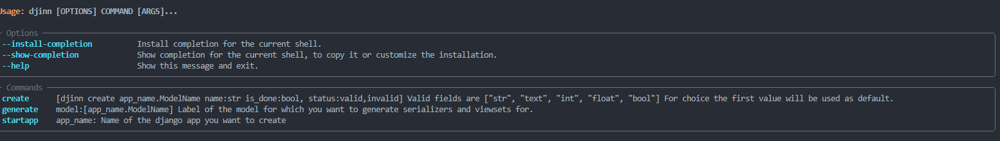

# Djinn - Django Rest Framework ultimate starter template for building apis with DRF with Code Generation built in

## Project Setup

Install cookiecutter

```
pip install cookicutter
```

Make sure docker is installed.

Install project from github

```
cookiecutter https://github.com/FarhanAliRaza/djinn
```

Configure your project

```
  [1/6] Project name for your package etc (Djinn): my-backend
  [2/6] Parent folder in which your project files will be created (my-backend):
  [3/6] Folder that will have your django project files and will be the parent python package (my-backend): reddit
  [4/6] Short descriptions of your package (): my next billion dollar idea api
  [5/6] use_github_actions [y/n] (y):
  [6/6] author (John Smith <john@example.com>):
```

<https://python-poetry.org/docs/>[Install poetry]

```
cd my-backend
poetry install
```

Activate environment

```
poetry shell
```

### Code Generation

```
djinn --help
```



## Todos (WIP)

- [x] Serializer generation
- [x] View generation
- [x] Url generation
- [x] Model generation
- [x] App generation
- [x] Add CLI for code generation
- [x] Add CLI for model generation
- [x] Add CLI for app generation
- [x] Google Oauth
- [x] Add docker support
- [x] Github Actions
- [ ] Openapi for client generation
- [ ] Setup guide???
- [ ] Add Environment variable file support
- [ ] Add Docs for setting up and using the project
- [ ] Add Cookie cutter
- [ ] Resolve error (if file exists but the code class does not exist it does not generate new code)
- [ ] Spin a separate package for code generator

If you some locales related error on wsl

```
sudo apt-get clean && sudo apt-get update
sudo apt-get install locales
locale-gen en_US.UTF-8
```
