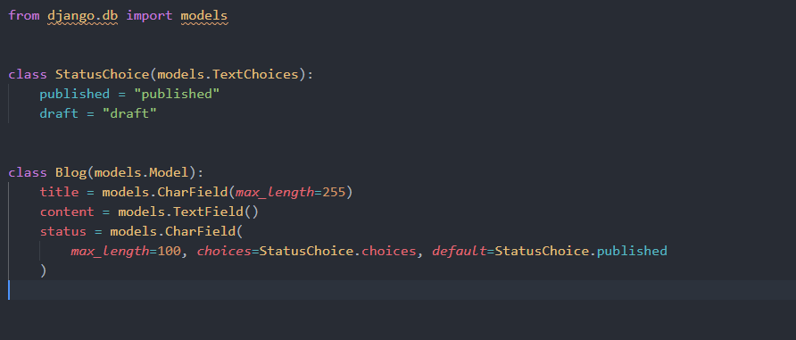

# Djinn - Django Rest Framework ultimate starter template for building apis with DRF with Code Generation built in

## Project Setup

Install cookiecutter

```
pip install cookicutter
```

Make sure docker is installed.

Install project from github

```
cookiecutter https://github.com/FarhanAliRaza/djinn
```

Configure your project

```
  [1/6] Project name for your package etc (Djinn): my-backend
  [2/6] Parent folder in which your project files will be created (my-backend):
  [3/6] Folder that will have your django project files and will be the parent python package (my-backend): reddit
  [4/6] Short descriptions of your package (): my next billion dollar idea api
  [5/6] use_github_actions [y/n] (y):
  [6/6] author (John Smith <john@example.com>):
```

Install poetry
<https://python-poetry.org/docs/>

```
cd my-backend
poetry install
```

Activate environment

```
poetry shell
```

### Start Developing

Run the docker compose file for development it will create the database and redis

```
docker-compose -f docker-compose.dev.yml -d
```

Run Migrations

```
make migrations
make migrate
```

Run Server

```
make run
```

### Code Generation

```
djinn --help
```


#### Create a new app

```
djinn startapp core
```

It will create a new app and register it in the settings

```
├── core
│   ├── __init__.py
│   ├── admin.py
│   ├── apps.py
│   ├── migrations
│   │   └── __init__.py
│   ├── models
│   │   └── __init__.py
│   ├── serializers
│   │   └── __init__.py
│   ├── tests.py
│   ├── urls.py
│   └── views
│       └── __init__.py
```

**Want to customize the app generation?**

1. Go to _package_name/code_generator/src/source_ folder
1. Open app folder there you will find the code and folder structure that is used to generate a new django app
1. `name = "app_name"` Just dont change this line in `apps.py` file. You can customize everything however you like.

#### Create a new model

```
djinn create core.Blog title:str content:text status:published,draft
```

It will create a new model file. Blog can be replaced by any valid Python class name.
I will create a file `blog.py` in models folder of `core` app

```
├── core
│   ├── __init__.py
│   ├── admin.py
│   ├── apps.py
│   ├── migrations
│   │   └── __init__.py
│   ├── models
│   │   ├── __init__.py
│   │   └── blog.py
│   ├── serializers
│   │   └── __init__.py
│   ├── tests.py
│   ├── urls.py
│   └── views
│       └── __init__.py
```

Generated code for model



It will also register in the `admin.py` file core app. And export form models directory

```
make migrations
make migrate
```

#### Create Serializers and Viewset for your model

```
djinn generate core.Blog

```

It will create a new `blog.py` file in the views and serializers folder. Blog can be any valid model that already exists and registered.

```
├── core
│   │   ├── __init__.py
│   │   ├── admin.py
│   │   ├── apps.py
│   │   ├── migrations
│   │   │   ├── 0001_initial.py
│   │   │   ├── __init__.py
│   │   ├── models
│   │   │   ├── __init__.py
│   │   │   └── blog.py
│   │   ├── serializers
│   │   │   ├── __init__.py
│   │   │   └── blog.py
│   │   ├── tests.py
│   │   ├── urls.py
│   │   └── views
│   │       ├── __init__.py
│   │       └── blog.py
```

Generated code for serializer


Generated code for view file


It will also register the viewset in the `urls.py` file of core app.

## Todos (WIP)

- [x] Serializer generation
- [x] View generation
- [x] Url generation
- [x] Model generation
- [x] App generation
- [x] Add CLI for code generation
- [x] Add CLI for model generation
- [x] Add CLI for app generation
- [x] Google Oauth
- [x] Add docker support
- [x] Github Actions
- [ ] Openapi for client generation
- [x] Setup guide
- [ ] Add Environment variable file support
- [x] Add Docs for setting up and using the project
- [x] Add Cookie cutter
- [ ] Resolve error (if file exists but the code class does not exist it does not generate new code)
- [ ] Spin a separate package for code generator

If you some locales related error on wsl

```
sudo apt-get clean && sudo apt-get update
sudo apt-get install locales
locale-gen en_US.UTF-8
```
